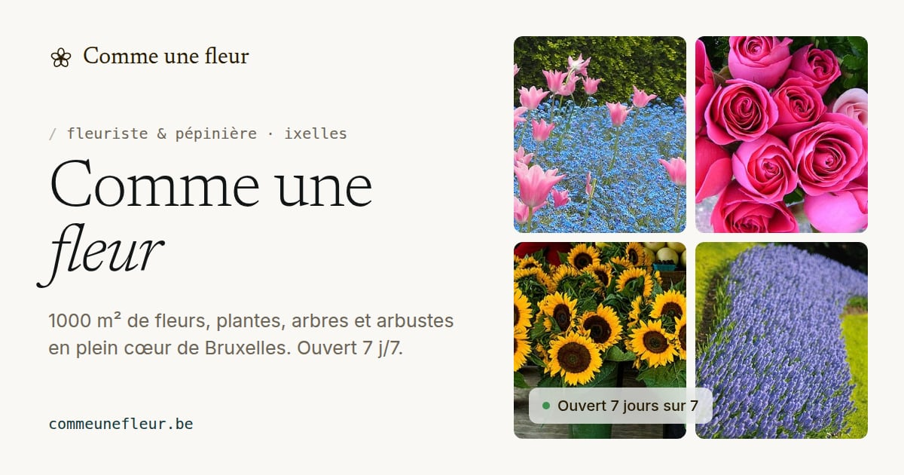

# Comme Une Fleur — site web

Site de **Comme Une Fleur**, fleuriste et pépinière de 1000 m² à Ixelles (Bruxelles) depuis 2002.
Design inspiré de la référence « Perplexity Computer » : fond parchemin, texte sépia, grands titres
serif très légers, cartes blanches sans ombre, boutons en pilule, photos nettes, **beaucoup d’air**.



- **`frontend/`** : le site (Astro, pages statiques ultra-rapides) ;
- **`api/`** : l’API séparée du front (Node.js) : formulaire, anti-spam, statistiques, liens cassés, tableau de bord ;
- **`shared/`** : ce qui sert aux deux (infos de la boutique, horaires, règles du formulaire, redirections).

---

## Démarrer en local

```bash
npm install
npm run dev          # site : http://localhost:4321  ·  API : http://localhost:8787
```

Node.js 22.12 ou plus récent est nécessaire.

## Importer les vraies photos

Les photos viennent du site actuel commeunefleur.be (bibliothèque WordPress + pages) :

```bash
npm run photos:import                                  # depuis https://commeunefleur.be
npm run photos:import -- --from-dir ~/Photos/boutique  # ou depuis un dossier
npm run build && npm run og -w frontend                # reconstruire + images de partage avec les photos
```

Chaque photo est redressée, réduite à 2400 px, recompressée, **débarrassée de ses métadonnées GPS**,
puis déclinée au build en **AVIF et WebP** à plusieurs tailles. Textes alternatifs, catégories,
photo d’accueil et photos mises en avant se règlent dans `frontend/src/data/photos.json`
(mode d’emploi : `frontend/src/assets/photos/README.md`).

En attendant, le site montre **33 photos de fleurs d’illustration** sous licence libre (CC BY 2.0,
auteurs crédités dans la galerie et dans les conditions d’utilisation). Elles sont retirées
automatiquement dès que les vraies photos sont importées. L’accueil affiche une grande photo plein écran
si l’une d’elles fait au moins 1600 px de large, sinon une mosaïque de photos : jamais d’image étirée ni floue.

## Ce qui est inclus

| Demande | Réalisation |
|---|---|
| Page d’accueil avec toutes les photos | Mosaïque de photos nettes en ouverture, puis galerie complète sur l’accueil (`/#galerie`) : filtres par thème, « afficher plus », visionneuse plein écran (clavier, glisser du doigt) |
| Vraies offres | Fleurs & bouquets, plantes, pépinière, événements, entretien, sapins de Noël, 2 adresses, horaires, histoire depuis 2002 (sources en bas de page) |
| Animations utiles, pas décoratives | Titre qui apparaît dans l’ordre de lecture · photos de l’accueil qui arrivent une à une · statut « Ouvert / Fermé » en direct · menu qui se replie en capsule au défilement · blocs qui apparaissent au rythme de la lecture · filtres de galerie qui glissent vers leur place · zoom de la vignette vers la visionneuse · frise de l’histoire qui se dessine · erreurs de formulaire qui apparaissent sous le champ · fleur qui s’ouvre quand le message est parti · compte à rebours visible sur la page 404 · transitions douces entre les pages. Tout est coupé si l’appareil demande « réduire les animations ». |
| Site aéré | Marges de 96 à 184 px entre sections, largeur de lecture limitée, peu d’éléments par ligne |
| Page RGPD | `/confidentialite/` (responsable, données, bases légales, durées, droits, APD) |
| Page CGU | `/cgu/` (+ mentions légales de l’éditeur) |
| API hors front-end | `api/` : serveur Node indépendant (routes ci-dessous) |
| Bannière cookies | « Tout refuser » aussi simple que « Tout accepter », réglages détaillés, choix modifiable (pied de page), preuve du consentement enregistrée |
| Meta title, description | Uniques par page + balise canonique + données structurées (fiche commerce local Google) |
| Images réseaux | Images de partage 1200×630 (Facebook, WhatsApp, LinkedIn, X) : `frontend/public/og/` |
| Favicon | `favicon.svg`, `favicon.ico`, icône Apple, icônes Android + manifeste |
| Sitemap + robots.txt | `/sitemap-index.xml` et `/robots.txt` générés à chaque build |
| Textes des images | Chaque image a un texte alternatif ; le contrôle automatique refuse une image sans |
| Compression des images | Import (JPEG optimisé) puis AVIF/WebP responsive, chargement différé |
| Vitesse | Lighthouse mobile : 98–100 en performance, 120 à 370 Ko par page selon les photos, polices allégées et hébergées sur le site, CSS intégré, pré-chargement des pages suivantes, fichiers pré-compressés (Brotli) |
| Contraste | Couleurs vérifiées WCAG 2.2 AA (`npm run check`) ; le gris de la référence a été assombri pour passer |
| Page 404 personnalisée | « Cette page s’est fanée. » avec redirection automatique si l’ancienne adresse est connue, ou suggestion de la page la plus proche |
| Responsive | Du téléphone (360 px) au grand écran ; menu plein écran sur mobile |
| Anti-spam | Champ piège invisible, jeton horodaté signé, limite d’envois par visiteur, filtre de contenu (liens, mots publicitaires, doublons) ; sans captcha |
| Outil d’analytics | Mesure d’audience maison, anonyme, sans cookie, après consentement ; tableau de bord `/admin` (visites, provenance, appels, itinéraires, messages) |
| Réparer les liens cassés | Anciennes adresses WordPress redirigées (301) · page 404 qui corrige · liens cassés signalés et listés dans `/admin` avec la correction à faire · vérificateur de liens avant chaque mise en ligne |
| Valider le formulaire | Mêmes règles dans le navigateur (en direct, messages clairs, suggestion « gmial.com → gmail.com ») et dans l’API ; fonctionne aussi sans JavaScript |

### Routes de l’API

| Route | Rôle |
|---|---|
| `GET /api/health` | État du serveur |
| `GET /api/token` | Jeton anti-spam pour le formulaire |
| `POST /api/contact` | Message du formulaire (JSON ou formulaire classique) → e-mail à la boutique |
| `POST /api/collect` | Mesure d’audience (après consentement) |
| `POST /api/consent` | Preuve du choix de cookies |
| `POST /api/report-404` | Signalement d’une page ou image introuvable |
| `GET /admin` | Tableau de bord (mot de passe) · `GET /admin/messages.csv` : export Excel |

## Mettre en ligne

**Option A — un seul serveur (recommandé).** L’API sert aussi le site construit, avec les
redirections, la vraie page 404, la compression et les en-têtes de sécurité.

```bash
npm ci
npm run build
cp api/.env.example api/.env   # puis remplir APP_SECRET, ADMIN_PASSWORD, SMTP…
npm start                      # port 8787, à placer derrière Nginx/Caddy/l’hébergeur en HTTPS
```

Sauvegarder le dossier `api/data/` (messages et statistiques).

**Option B — site statique + API ailleurs.** Le dossier `frontend/dist/` peut être envoyé tel quel
sur Netlify, Cloudflare Pages ou un hébergement mutualisé Apache (FTP) : `_redirects`, `_headers`
et `.htaccess` sont générés automatiquement. L’API tourne alors sur un service Node (Render,
Railway, VPS…) :

```bash
PUBLIC_API_URL=https://api.commeunefleur.be npm run build   # côté site
ALLOWED_ORIGINS=https://commeunefleur.be                    # dans api/.env
```

## À compléter avant la mise en ligne

- [ ] Importer les photos (`npm run photos:import`) et relire leurs textes alternatifs : elles remplacent les photos d’illustration
- [ ] Mentions légales : dénomination, n° BCE, TVA, siège, hébergeur → `shared/business.js` (`legal`)
- [ ] E-mails : SMTP dans `api/.env` (avec Gmail : « mot de passe d’application »)
- [ ] `APP_SECRET` et `ADMIN_PASSWORD` dans `api/.env`
- [ ] Vérifier horaires, téléphones et textes dans `shared/business.js` et `frontend/src/data/site.js`
- [ ] Faire relire les pages juridiques (modèles rédigés pour le site, pas un avis juridique)

## Vérifications

```bash
npm test                 # règles du formulaire, horaires, redirections, API, anti-spam, purge RGPD
npm run build            # construit le site (+ compression, redirections, en-têtes)
npm run check            # liens cassés, ancres, sitemap, HTML valide, accessibilité, contrastes
npm run check:external   # + liens vers les autres sites
```

La même série tourne automatiquement sur GitHub à chaque envoi (`.github/workflows/ci.yml`).

## Structure

```
shared/      business.js (infos boutique) · hours.js · validation.js · redirects.js · csp.js
frontend/    src/pages (accueil, offres, contact, confidentialite, cgu, merci, 404)
             src/components · src/scripts (animations, galerie, formulaire, cookies, statistiques)
             src/data (offres, photos.json) · src/assets (photos, polices, fonds flous)
             tools/ (import des photos, icônes, images de partage, vérifications, post-build)
api/         src/app.js (routes) · src/lib (anti-spam, stockage, e-mails, statistiques, tableau de bord)
```

## Sources des informations

Adresses, horaires, services et histoire repris de commeunefleur.be et de fiches publiques
(ixelles.city, pagesdor.be, brusselslife.be, commeunefleur.wordpress.com — « Comme une histoire »).
Tout est centralisé dans `shared/business.js` et `frontend/src/data/site.js` pour être corrigé en un seul endroit.
